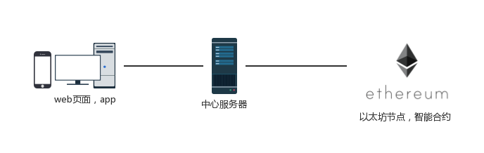
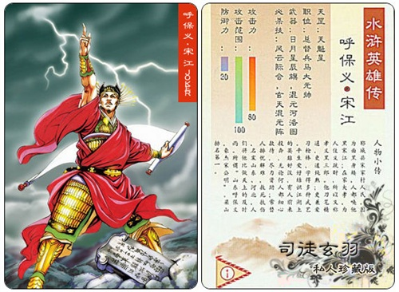
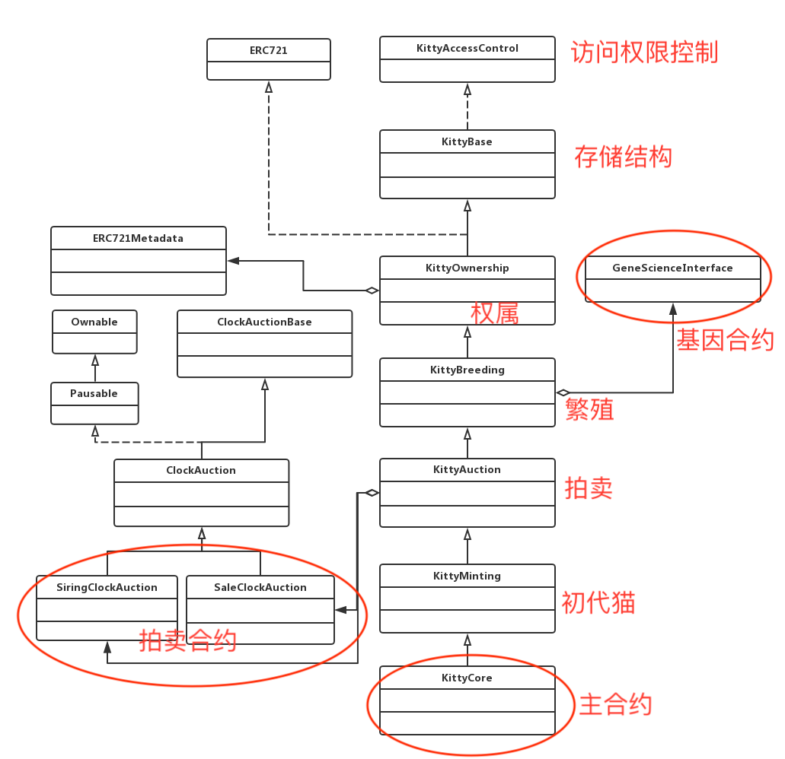
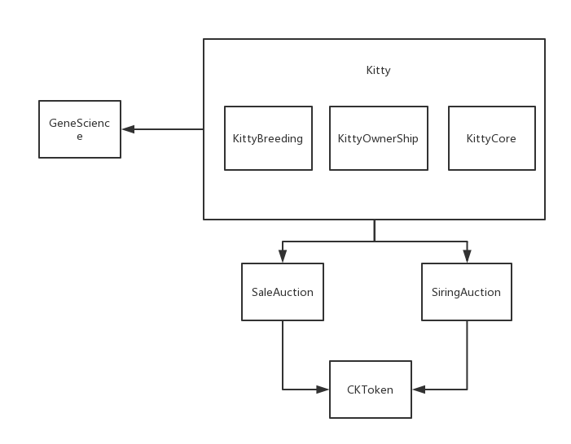
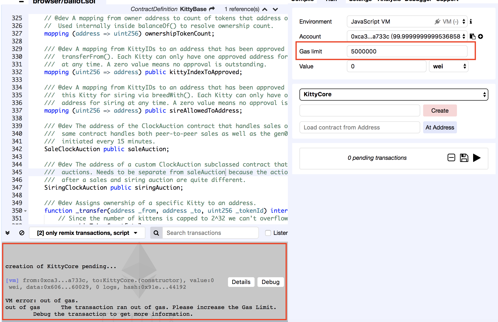

# 以太猫项目

## 项目简介

模仿以太坊上面的CryptoKitties的一个项目。


与其不同的是：
* 以太猫希望通过帮助用户操作以太坊的账号，达到降低参与游戏的门槛的目的；
* 并且猫咪的相关交易使用他们自己发行的猫币，而不是直接使用eth；
* 并且在未来加入除了拍卖、配育以外的其他玩法。

下面是以太猫项目的一个很简单的网络结构图。可以看出对于用户而言，跟一般的app体验没有不同。



上图中的中心服务器负责处理前端的请求，并且负责与合约进行交互。同时中心服务器掌握所有账号的私钥。

## ERC20和ERC721
CryptoKitties是eth上的一个智能合约的应用。每只电子猫拥有独一无二的256位的基因，实现的功能就是电子猫的繁殖与交易两个功能。
本质上来看，CryptoKitties就是非同质代币(ERC721)的一个实现。

什么是ERC721？

和马上提到的ERC20一样，它们是eth智能合约的标准，简单点说就是定义好的接口，后面的数字只是编号。

ERC20是以太坊的同质货币的标准。相对ERC721是非同质的货币标准。

ERC20可以对应我们现实生活中的货币，在支付或结算时，某个部分或数量可以被另一个同等部分或数量所代替。


ERC721代币，可以简单类比我们小时候收集的一些卡片，它只对与特定人群有收藏的价值。




除了具有收藏价值的特点外，ERC721还要求代币有独特性。每个ERC721的代币都是唯一的。
其实使用"拍卖行拍卖的艺术品"的例子更为恰当。

CryptoKitties中的猫，其实就是对于ERC721合约的一个实现，每一只猫就是对应一个ERC721的Token。
合约中每只猫有唯一的256bit的基因，这个独特的基因就是以太猫的收藏价值所在。

现实生活中的类似这样具有唯一性的资产，如果对应到智能合约中，都可以使用ERC721的Token带代表，例如现实生活中的停车位、房产、艺术家的作品等。

## CryptoKitties代码的结构

简单画了一个CryptoKitties的类图。



以太猫结合ERC20的简单结构如下:



* [CryptoKitties源码](https://etherscan.io/address/0x06012c8cf97bead5deae237070f9587f8e7a266d#code)

## 智能合约开发中的遇到的一些问题
##### 开发环境
1. [remix](https://remix.ethereum.org)，对应的github[地址](https://github.com/ethereum/remix)。里面可以找到doc。
2. vscode、idea的solidity的插件

##### 书写合约的一些限制
1. 合约本身不能太大，否则会出现部署合约消耗gas超过一个区块的gas limit，而导致合约无法部署。在合约开发过程中不要将gas limit设置超过4.7m。



例子：crypto kitties源码直接部署到remix js环境中需要设置gas到7m，据了解，jsvm的区块gas limit 应该在6m多,
而eth测试和生产环境的区块gas是4.7m。

2. 合约中的一个方法变量的数量有限制(大致是16个，包含输入参数，返回参数和本地变量)，开发中注意方法参数数量不要过多。

```
// 在我删掉三个参数之后编译通过。
function getKittyDetail(uint256 kittyId) external view returns (
        uint256 genes,
        uint256 birthTime,
        uint256 cooldownEndTime,
        uint256 matronId,
        uint256 sireId,
        uint256 siringWithId,
        uint256 cooldownIndex,
        uint256 generation,
        uint256 breedTimes,
        uint256 character,
        uint256 speed,
        uint256 iq,
        uint256 physical,
        uint256 skill
    ) {
        uint256 _tokenId = kittyIdToKittyIndex[kittyId];
        require (_tokenId != 0);
        Kitty storage kit = kitties[_tokenId];
        cooldownIndex = uint256(kit.cooldownIndex);
        cooldownEndTime = uint256(kit.cooldownEndTime);
        siringWithId = uint256(kit.siringWithId);
        birthTime = uint256(kit.birthTime);
        matronId = uint256(kit.matronId);
        sireId = uint256(kit.sireId);
        generation = uint256(kit.generation);
        genes = kit.genes;
        breedTimes = uint256(kit.breedTimes);
        character = uint256(kit.character);
        speed = uint256(kit.speed);
        iq = uint256(kit.iq);
        physical = uint256(kit.physical);
        skill = uint256(kit.skill);
    }
```

3. 合约之间相互调用的时候注意msg.sender指代对象。

##### gas相关
1. 在调用合约时，gas limit 的设置过低，可能导致执行中gas被耗尽而执行失败。
2. 开发和测试环境中可以提高gas price(1000Gwei)以加快交易被确认，节约时间。

##### 部署相关
1. 使用remix直接部署。
2. 使用web3.js进行自动部署，并初始化，更加方便而且不易出错。

